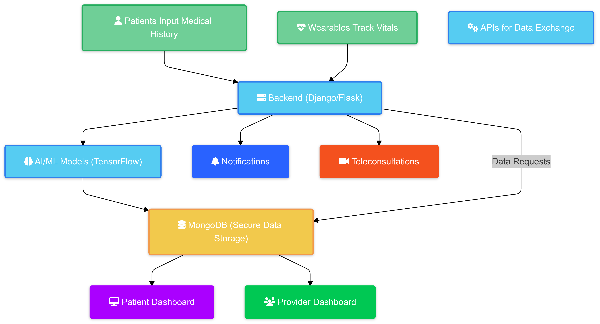

# 🌟 AI-Powered Holistic Patient Recovery Assistant  
### Team Crisis@127.0.0.1  

  

Welcome to the future of healthcare recovery! Our *AI-Powered Holistic Patient Recovery Assistant* is designed to revolutionize post-treatment care by leveraging cutting-edge technology to provide personalized, accessible, and effective recovery solutions for patients worldwide.  

---

## 📖 Table of Contents
- [Problem Statement](#problem-statement)
- [Solution Overview](#solution-overview)
- [Features](#features)
- [Tech Stack](#tech-stack)
- [How It Works](#how-it-works)
- [Future Scope](#future-scope)
- [System Architecture](#system-architecture)
- [Getting Started](#getting-started)
  - [Prerequisites](#prerequisites)
  - [Installation](#installation)
- [Demo](#demo)
- [Contributing](#contributing)
- [License](#license)

---

## ❓ Problem Statement  
The healthcare recovery system faces significant challenges:  
- Recovery plans are generic and fail to meet individual patient needs.  
- Accessibility to quality care is limited, especially in underserved areas.  
- High costs and inefficiencies burden patients and healthcare systems.  
- Preventable readmissions highlight gaps in recovery management.  

---

## 🚀 Solution Overview  
Our solution tackles these challenges with:  
1. **AI-Powered Personalized Plans**: Customized to the patient’s unique needs and treatment history.  
2. **Real-Time Monitoring**: Wearables track vitals like heart rate and blood pressure.  
3. **Digital Twin Technology**: Predicts potential recovery issues for proactive intervention.  
4. **Teleconsultation and Chatbots**: Ensures 24/7 support and seamless follow-ups.  

---

## 📊 Features  
| Stakeholder       | Features                                                                 |
|-------------------|---------------------------------------------------------------------------|
| **Patients**      | Tailored recovery plans, accessible anytime.                             |
| **Providers**     | Tools for proactive alerts and efficient workload management.            |
| **Healthcare**    | Reduced readmissions, lower costs, and improved population health.       |

---

## 🔧 Tech Stack  
- **Frontend**: React Native (Intuitive user interface).  
- **Backend**: Django/Flask (API and logic layer).  
- **AI/ML**: TensorFlow (Predictive analytics and personalized plans).  
- **Database**: MongoDB (Secure data storage).  
- **IoT Integration**: Platforms like Fitbit and Apple HealthKit (Real-time data collection).  

---

## 🛠️ How It Works  
1. **Patient Input**: Medical history and recovery goals are entered into the system.  
2. **Plan Generation**: AI analyzes the data to create a personalized recovery plan.  
3. **Monitoring**: Wearables track vitals and send real-time data.  
4. **Alerts**: AI detects anomalies, updates plans, and notifies caregivers.  
5. **Teleconsultation**: Patients receive follow-ups via video calls and chatbots.  

---

## 🔮 Future Scope  
- **AR-Based Therapy**: Enhancing physical rehabilitation through engaging visuals.  
- **Voice-Assisted Recovery**: Making recovery tools accessible for the elderly and differently-abled.  
- **AI for Public Health**: Identifying health trends and risks for early intervention.  

---

## 🖥️ System Architecture  


---

## 🚀 Getting Started  
### Prerequisites  
- Python 3.9+  
- Node.js and npm  
- MongoDB setup  
- Fitbit/Apple HealthKit developer account (for IoT integration).  

### Installation  
1. Clone the repository:  
   ```bash  
   git clone https://github.com/KeertanaGupta/Crisis_127.0.0.1.git  
   cd Crisis_127.0.0.1  
